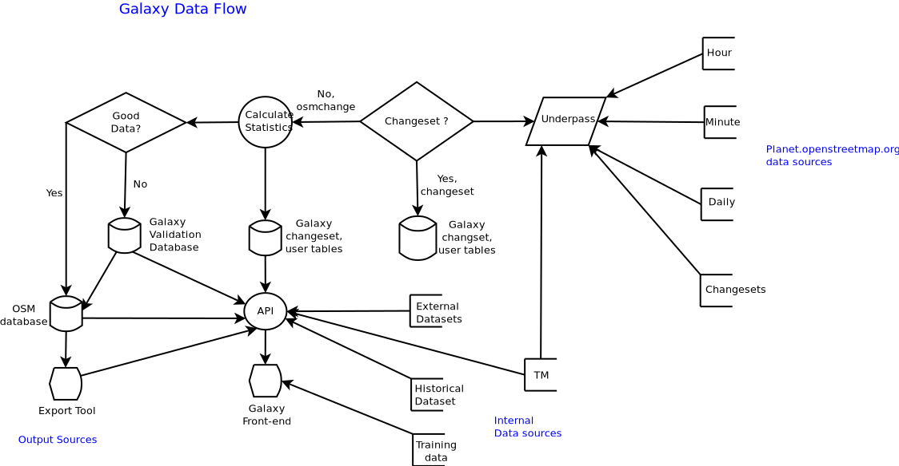

# Underpass Data Flow

## Source Data

Underpass collects data from multiple sources, primarily the 
[Change Files](changefile.md) from the OpenStreetMap *planet*
server. Changes are availble with different time intervals. The
**minutely** one are the primary data source. There are two sets of
minute update, one documents the change and the other is the changed
data itself.

### Directory Organization

Almost all directories and files are numerically based. The very [top
level](https://planet.openstreetmap.org/replication/) contains the
intervals, and the changeset directories, and looks like this:

	minute/
	changeset/
	hour/
	day/

Under each one of these top level directories are the numerical
ones. At the lowest level there are 1000 files in each directory, so
the value is always a consistent 3 digit number.

	...
	002/
	001/
	000/

Under each on of these sub-directories are the actual data ones

	999/
	998/
	...
	001/
	000/

Each one of these directories contains 1000 file, roughly 16 hours
of data.

	replication/002/
	replication/002/002/
	replication/002/002/002/
	replication/002/002/002/
	replication/002/002/002/002.state.txt
	replication/002/002/002/002.osm.gz

The state file contains the ending timestamp of the associated data
file. Underpass uses the *state.txt* file to find the right data. THe
timestamps are not a consistent time interval, so it's not really
possible to just calculate the right data file. To speed up searching
for the right data file based on a timestamp, Underpass downloads them
and enters the path to the data file and the timestamp into postgres.

This process works forward and backwards. When initializing a database
from scratch, Underpass will just bulk download the state files,
starting with the most recent ones, and then going backwards in
time. It takes about a week to download all the minutely *state.txt*
files, *hourly* only a few hours.

Underpass can also monitor for new data files, so as to keep up to
date. If the database is up to date, the threads are put to sleep, and
wake up a minute later to see if there are new files. If behind by
several minutes, Underpass will bulk download them until caught up.

Underpass uses simple threading, so can utilize multiple CPU
cores. When a new data file is downloaded, it's uncompressed and
parsed. During the parsing process, some data validation is done.
If a change fails validation, it's written to a database table so a
validator can look into the issue later. If it passes validation, then
statistics are calculated, and written to the **OSM Stats**
database. Some data also comes from the Tasking Manager.

In the near future, Changes will also be applied to a standard OSM
database so it can be quered for data extracts.

&nbsp;

