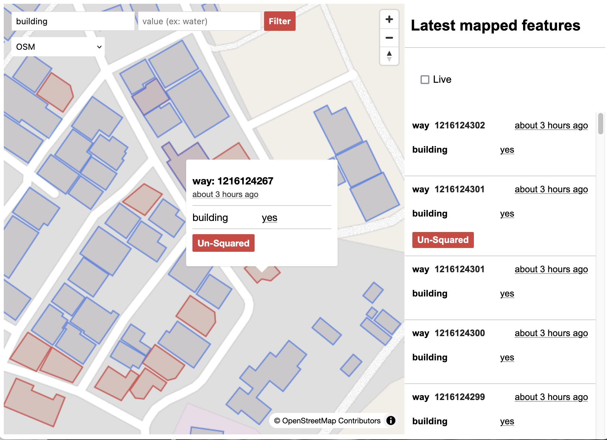

# Underpass documentation

## What's Underpass?

### Underpass is a customizable data engine that processes mapping data.

It can update a local copy of the OSM database in near real-time, and provides customizable statistics and validation reports. It is designed to be high performance on modest hardware.

